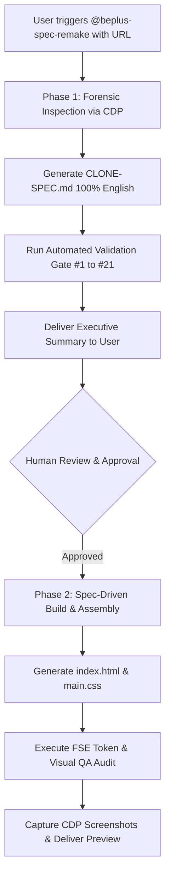

# Beplus Spec Remake Engine (`beplus-spec-remake`)

> **Autonomous 2-stage specification-driven website clone & reconstruction engine for OpenCode and OpenDesign, purpose-built for WordPress Gutenberg Full Site Editing (FSE) AlonePro standards.**

[](https://github.com/ducdung196qtr/beplus-spec-remake)
[](https://wordpress.org/)
[](https://opensource.org/licenses/MIT)

---

## 📖 Overview

The **Beplus Spec Remake Engine** (`beplus-spec-remake`) eliminates "hallucinatory AI design" by enforcing an uncompromising **2-stage specification-driven pipeline**:

1. **Stage 1 (Forensic Architectural Specification)**: The agent executes Chrome DevTools Protocol (CDP port 9222) forensics and computed DOM AST analysis against the live reference website. It extracts every color token, fluid clamp typography curve, grid geometry, optical icon proportion, and interaction dynamic, compiling them into a comprehensive, strictly English architectural contract: **`CLONE-SPEC.md`**.
2. **Stage 2 (Spec-Driven Build & Zero-Manual Assembly)**: Following human approval of the spec, the agent reads `CLONE-SPEC.md` and generates clean, semantic, production-grade **`index.html`** and **`main.css`** compliant with 100% WordPress Gutenberg FSE token conventions (`var(--wp--preset--*)`). Zero manual coding is required.

---

## 🚀 Installation & Setup in OpenCode / OpenDesign

### Method 1: Docker Environment (OpenDesign Server / Container)

If you are running the OpenDesign web workspace or OpenCode daemon in Docker:

1. **Clone or Copy the Skill into the Container**:
   ```bash
   # From your host machine:
   git clone https://github.com/ducdung196qtr/beplus-spec-remake.git /tmp/beplus-spec-remake
   docker cp /tmp/beplus-spec-remake/. open-design:/app/skills/beplus-spec-remake/
   ```

2. **Set Ownership & Read Permissions**:
   ```bash
   # Ensure the container user (typically open-design:open-design or UID 1001) has full read/exec access:
   docker exec -u 0 open-design chown -R 1001:1001 /app/skills/beplus-spec-remake/
   docker exec -u 0 open-design chmod -R a+rX /app/skills/beplus-spec-remake/
   ```

3. **Verify Skill Registration**:
   Confirm that OpenDesign registers the skill by querying the internal API or viewing your OpenDesign workspace:
   ```bash
   curl -s http://127.0.0.1:7456/api/skills | jq '.skills[] | select(.id=="beplus-spec-remake")'
   ```

4. **Invoke in OpenDesign UI**:
   - In any OpenDesign conversation, prefix your message with the skill tag:
     ```text
     @beplus-spec-remake https://target-website.com/
     ```
   - Or configure the project's `skillId` to `beplus-spec-remake` upon creation.

---

### Method 2: OpenCode CLI (Local Workstation or VM)

If you use `opencode-cli` directly on macOS, Linux, or a VPS:

1. **Clone into the OpenCode Skills Directory**:
   ```bash
   mkdir -p ~/.config/opencode/skills
   cd ~/.config/opencode/skills
   git clone https://github.com/ducdung196qtr/beplus-spec-remake.git beplus-spec-remake
   ```

2. **Add to `opencode.json` (Optional Explicit Mapping)**:
   In `~/.config/opencode/opencode.json`:
   ```json
   {
     "skills": {
       "beplus-spec-remake": {
         "path": "~/.config/opencode/skills/beplus-spec-remake",
         "enabled": true
       }
     }
   }
   ```

3. **Run via CLI**:
   ```bash
   opencode-cli run --dir /path/to/project --prompt "Clone and reconstruct website: https://target-website.com/ using skill beplus-spec-remake"
   ```

---

### Method 3: Hermes Agent Integration

For autonomous agent orchestrations running under Hermes Agent:
```bash
git clone https://github.com/ducdung196qtr/beplus-spec-remake.git ~/.hermes/skills/web-design/beplus-spec-remake
```
Hermes will automatically index the skill under `skills_list` and load it via `skill_view(name='beplus-spec-remake')`.

---

## 🛠️ Prerequisites & Environmental Requirements

| Requirement | Purpose | Configuration / Command |
| :--- | :--- | :--- |
| **Headless Chromium (CDP)** | Live DOM geometry, fluid typography, and CSS variable extraction | Must listen on port `9222`: `--remote-debugging-port=9222 --remote-debugging-address=0.0.0.0` |
| **Node.js 18+** | Runs `inspect-site.mjs` and automated validation scripts | Built into OpenDesign container (`node -v`) |
| **Python 3.10+** | Runs Quality Gate compliance audits and BeautifulSoup AST checks | Standard Linux toolchain (`python3`) |
| **Lucide Icon Library** | Replaces all raster images $\le$ 64px with crisp inline SVGs | Integrated via `stroke-width="1.75"` vector definitions |

---

## 🔄 Standard Operational Workflow



1. **Phase 1 (Forensic Inspection & Specification)**:
   - Provide the URL: `@beplus-spec-remake https://reference-site.com/`
   - The AI inspects typography, styles, layout geometry, optical icon hierarchy, and motion dynamics.
   - Outputs a comprehensive `CLONE-SPEC.md` covering all sections.
   - **Halts execution and awaits human confirmation.**
2. **Phase 2 (Spec-Driven Build & Assembly)**:
   - Once approved (`"Approved, proceed to Phase 2"`), the agent reads `CLONE-SPEC.md`.
   - Synthesizes `index.html` and `main.css` strictly using Gutenberg FSE tokens.
   - Runs post-build compliance audits before presenting deliverables.

---

## ⚠️ Critical Guidelines & Core Caveats (Những Điểm Lưu Ý Sống Còn)

Adhering to these strict quality gates is what separates a professional, pixel-faithful reproduction from a generic AI-generated template:

### 1. Optical Icon Hierarchy & Anti-Miniaturization Standard (Gate #18)
* **The Root Cause**: AI models routinely render icons too tiny (14–16px) with ultra-thin hairline strokes (`stroke-width="1"`). Bold text (`font-weight: 700`) visually dwarfs naked icons, creating severe optical imbalance.
* **Mandatory 3-Tier Optical Architecture**:
  * **Tier 1 (Metric & Stat Cards like `8,000+`)**: Must use a **`52px × 52px` squircle container tile** (`.bento-badge`) with a **`28px` inline SVG** and **`stroke-width: 1.75`**.
  * **Tier 2 (Feature Capsules & Value Lists)**: Must use a **`38px × 38px` squircle icon box** (`.feature-icon-box`) with a **`20px` inline SVG** and **`stroke-width: 1.75`**. **Naked unboxed icons are strictly prohibited.**
  * **Tier 3 (Inline micro-elements & button chevrons)**: **`16px`** SVG with `stroke-width: 1.75`.
* **Zero AI Sparkle Ban**: Icons depicting sparkles, magic wands, or AI stars are forbidden.

### 2. WCAG AA Optical Contrast & Dark Canvas Typography Invariant (Gate #21)
* **Above-the-Fold Premature Dimming Ban**: Never wrap hero introductory descriptions in `span.scroll-word` with `opacity: 0.25`. The hero sits at `scrollTop: 0`; dimming on initial load produces unreadable text that fails WCAG AA standards.
* **Hero Subtext Contract**: Hero body text must be **100% visible and fully opaque upon initial page load** (`color: rgba(255, 255, 255, 0.88)` on dark canvases).
* **Dark Canvas Illumination Rule**: In dark sections (e.g. *What We Offer*), scroll-illuminated text must illuminate toward **pure white (`#ffffff` / `--wp--preset--color--base`)**, NEVER dark charcoal (`--wp--preset--color--contrast`).

### 3. Sticky Stacking Cards Scroll Physics (Gate #20)
* Multi-card service sections (*What We Offer*) must not be collapsed into a flat vertical list or generic grid.
* On desktop ($\ge$ 768px), cards must utilize native CSS `position: sticky` with staggered `top` offsets (`top: 80px, 110px, 140px...`) to produce a tactile, layered card-deck peeling sensation during scrolling.
* On mobile ($\le$ 767px), gracefully degrade to `position: static` with clean 16–20px gutters.

### 4. Workspace Hygiene & Zero Scraped Dump Leaks (Gate #19)
* **Never leave raw scraped dumps** (`target.html`, `dump.html`, `scraped.html`, `raw.html`) in the project root!
* Scraped inspection files must be isolated inside `/tmp/scratchpad/` and purged after Phase 1. Exposing raw dumps in the root directory causes the OpenDesign UI to index them, creating confusion.

### 5. Zero Vietnamese Tolerance in Specification MD (Gate #15)
* `CLONE-SPEC.md` must be composed in **100% professional technical English**.
* No Vietnamese characters or translation artifacts are allowed in markdown tables, column headers, or descriptions.

### 6. Zero Latin / Lorem Ipsum Mandate (Gate #3)
* Every single headline, value proposition, feature bullet, review, and FAQ must be original, high-grade commercial English copy.
* Any occurrence of `Lorem ipsum`, `dolor sit amet`, or placeholder tokens results in immediate QA rejection.

### 7. 100% WordPress Gutenberg FSE Token Compliance
* **Colors**: Exclusively use `var(--wp--preset--color--*)` (`base`, `contrast`, `primary`, `secondary`, `tertiary`, `paragraph`).
* **Spacing**: Exclusively use `var(--wp--preset--spacing--*)` (`10` to `60`).
* **Typography**: Exclusively use `var(--wp--preset--font-size--*)` (`small` to `xx-large`).
* **Strict Constraints**:
  - **Zero hardcoded pixels or hex outside `:root`**.
  - **Zero `!important`**.
  - **Zero Webflow-generated classes** (`w-dyn-list`, `w-dyn-item`, `offer-card-white`, etc.).

---

## 📂 Repository File Manifest

```text
beplus-spec-remake/
├── SKILL.md                                 # Master skill contract & 21 Quality Gates
├── README.md                                # Comprehensive setup & operational guide
├── scripts/
│   └── inspect-site.mjs                     # CDP/AST forensic inspection script
├── templates/
│   └── clone-spec-template.md               # 12-section blueprint template (100% English)
└── references/
    ├── forensic-inspection-patterns.md       # 35 tactical technical patterns
    ├── gutenberg-token-contract.md          # AlonePro FSE token mapping specification
    ├── heading-elements-contract.json       # W3C semantic heading validation schema
    └── opendesign-api-orchestration.md      # Headless daemon API triggering protocols
```

---

## 📄 License & Attribution

Developed and maintained by **Beplus** for high-precision autonomous web reconstruction.  
Licensed under the [MIT License](LICENSE).
